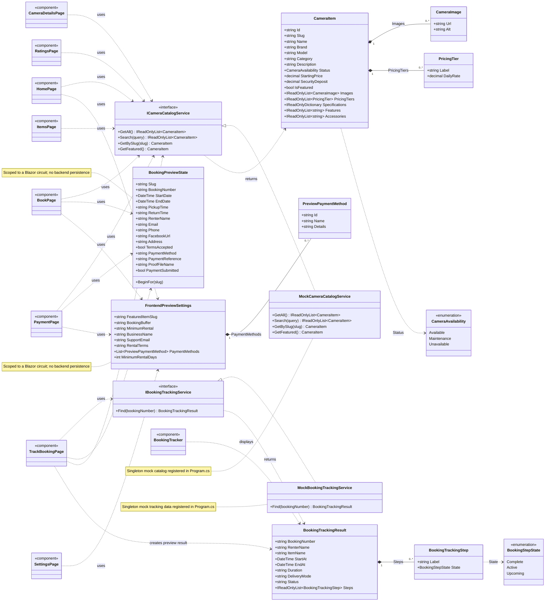

# Current-state class diagram

This diagram reflects the classes and dependencies currently implemented in the Blazor prototype. The catalog and tracking data are mock-backed. Booking and admin settings are scoped in-memory preview state; the application has no persisted `Booking`, `Customer`, or `Payment` entity.

## Existing model commits

The catalog models (`CameraItem`, `CameraImage`, `PricingTier`) and tracking models were already committed in `94b6a18` (`feat(blazor): organize frontend into feature slices`). The preview state used by the booking and admin flows was committed in `92cb82e` (`Checkpoint: connect Blazor preview interactions`). No duplicate model classes were added.
